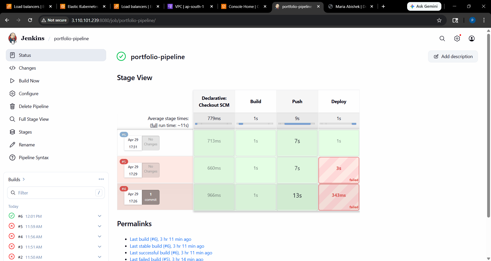
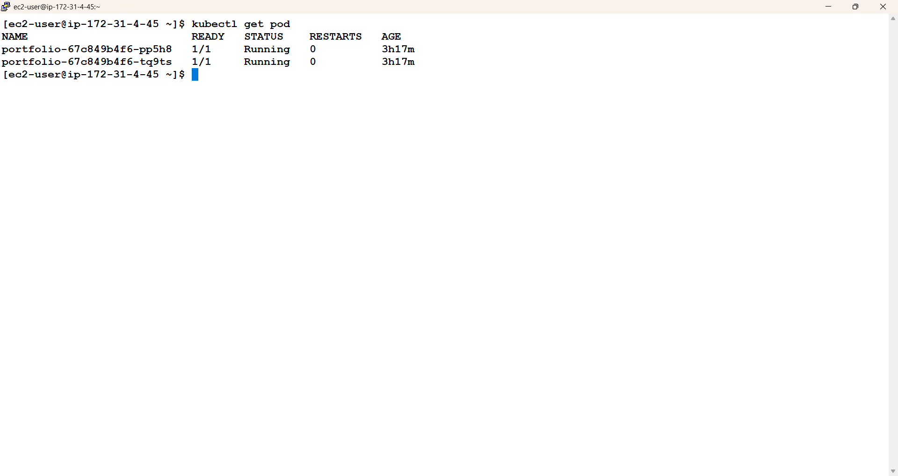
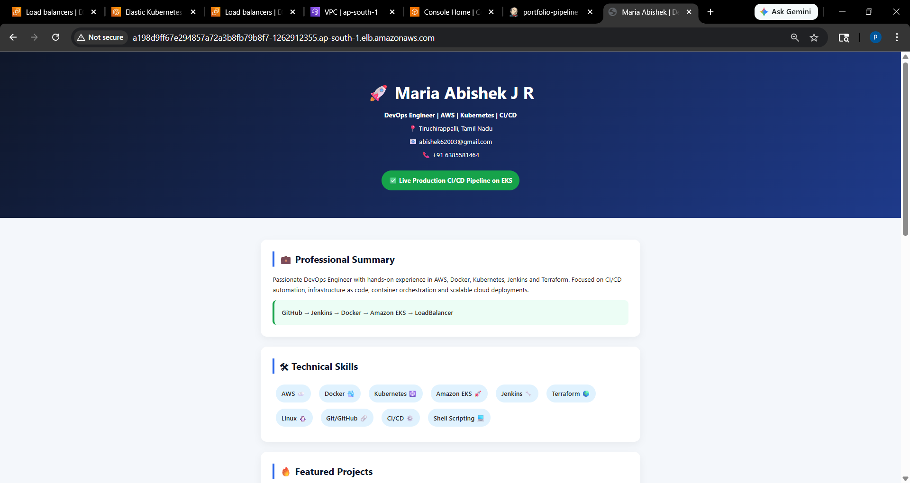

# 🚀 Production-Style CI/CD Pipeline on AWS EKS

## Architecture
```text
Developer Push
→ GitHub
→ Jenkins Pipeline
→ Docker Build
→ Docker Hub
→ Amazon EKS Deployment
```

## Features
- Built CI/CD pipeline using Jenkins
- Containerized app using Docker
- Pushed images to Docker Hub
- Deployed to Amazon EKS
- Automated rolling updates
- Configured Jenkins authentication to EKS
- Troubleshot real-world IAM and kubeconfig issues

## Tech Stack
- AWS EKS
- Jenkins
- Docker
- Kubernetes
- GitHub
- Linux
- IAM

## Pipeline Stages
Clone → Build → Push → Deploy

## Future Improvements
- Helm
- ArgoCD
- ECR
- GitOps
## Screenshots

### Jenkins Pipeline Success


### Kubernetes Pods Running


### Application Running

